# axone-mcp

> 🤖 [Axone](https://axone.xyz)’s [MCP](https://modelcontextprotocol.io/introduction) server – gateway to the dataverse for AI-powered tools


[](https://github.com/axone-protocol/axone-mcp/releases)
[](https://github.com/axone-protocol/axone-mcp/actions/workflows/lint.yml)
[](https://github.com/axone-protocol/axone-mcp/actions/workflows/build.yml)
[](https://github.com/axone-protocol/axone-mcp/actions/workflows/test.yml)
[](https://codecov.io/gh/axone-protocol/axone-mcp)
[](https://conventionalcommits.org)
[](https://github.com/semantic-release/semantic-release)
[](https://github.com/axone-protocol/.github/blob/main/CODE_OF_CONDUCT.md)
[](https://opensource.org/licenses/BSD-3-Clause)

## Axone’s MCP server

[Axone](https://axone.xyz)’s [MCP](https://modelcontextprotocol.io/introduction) server is a lightweight implementation that
exposes Axone’s capabilities through the standardized Model-Context Protocol. It includes an authorization layer to ensure
that access requests comply with the decentralized governance rules established on-chain.

```mermaid
flowchart LR
    classDef actor stroke:#808
    classDef system stroke:#0ff
    classDef resource stroke:#f00

    actor:::actor@{ shape: stadium, label: "Host with MCP Client<br>(Claude, IDEs, Tools)" }
    s3Proxy:::system@{ shape: rounded, label: "Axone<br>MCP server" }
    s3:::resource@{shape: lin-cyl, label: "Resources<br>server"}
    files@{ shape: docs, label: "resources" }
    axone:::system@{ shape: das, label: "🔗 Axone chain" }
    s3 --> files

    actor -- access --> s3Proxy

    s3Proxy ~~~

    s3Proxy -. ① 🛡️ check .-> axone
    s3Proxy -. ② ✅ access .-> s3
```



## Features


## Usage

Install the MCP server:

```sh
go install github.com/axone-protocol/axone-mcp@latest
```

### Usage with [Claude Desktop](https://claude.ai/download)

Add this to your `claude_desktop_config.json`:

```json
{
  "mcpServers": {
    "filesystem": {
      "command": "axone-mcp",
      "args": [
        "serve",
        "stdio"
      ]
    }
  }
}
```

### Run with SSE transport

```sh
axone-mcp serve sse --listen-addr localhost:8080
```

### Run with STDIO transport

```sh
axone-mcp serve stdio
```

## Build

- Be sure you have [Golang](https://go.dev/doc/install) installed.
- [Docker](https://docs.docker.com/engine/install/) as well if you want to use the Makefile.

```sh
make build
```
